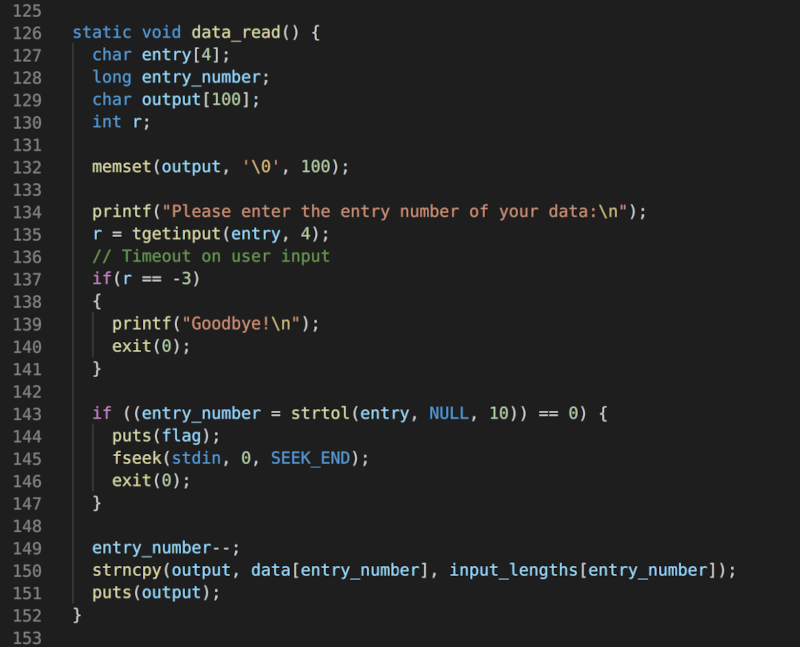
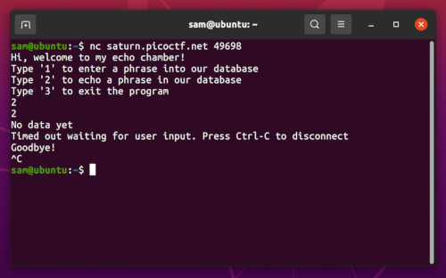
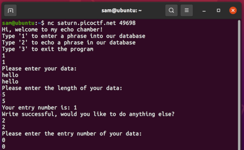

# basic-file-exploit

### Description

The program provided allows you to write to a file and read what you wrote from it. Try playing around with it and see if you can break it!

### Resources

- Endpoint: nc saturn.picoctf.net 49698
- program-redacted.c

### Solution

Using <kbd>CTRL+f</kbd> I looked through the source code given in the program-redacted.c for where the term 'flag' is used. I noticed it was used inside of the data_read function.

The function works using the following logic to give the flag:
1. Enter the entry number of the data you would like to read.
2. With the entry number, convert it to a long value with given base 10
3. Conversion must equal 0!

Using the endpoint, trying to access the second option resulted in the following output.

Therefore, it was necessary to input data before I could access this option. 

Then:

Flagtime :tada: