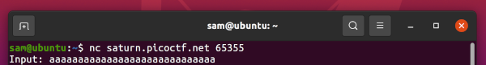

# buffer-overflow-0

### Description

Smash the stack Let's start off simple, can you overflow the correct buffer?

### Resources

nc saturn.picoctf.net 65445
vuln.c

### Solution

For this challenge, I simply connected using 'nc saturn.picoctf.net 65445' and filled the input with a bunch of a's.

Flagtime :tada: