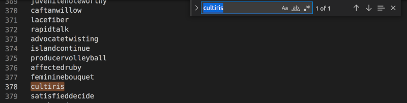
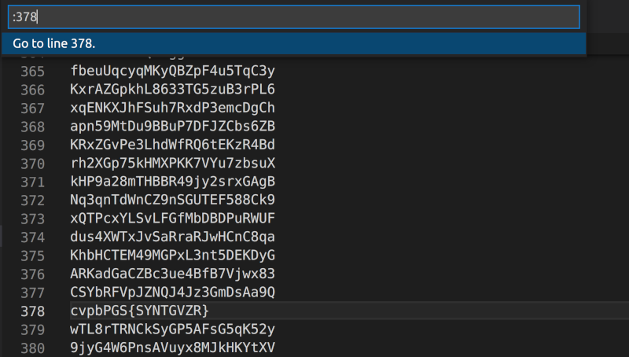
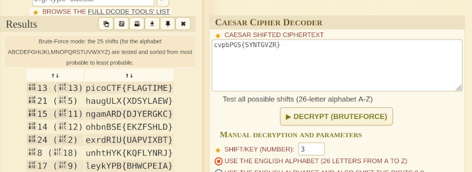

# credstuff

### Description

We found a leak of a blackmarket website's login credentials. Can you find the password of the user cultiris and successfully decrypt it? 

The first user in usernames.txt corresponds to the first password in passwords.txt. The second user corresponds to the second password, and so on.

### Resources

- leak.tar
    - usernames.txt
    - passwords.txt

### Solution

To start with, I extracted the tar file and then I used <kbd>CTRL+f</kbd> to find 'cultiris' in the usernames.txt file at line 378.

Then I used <kbd>CTRL+g</kbd> to find the line 378 in the passwords.txt file. 

Note: I was using visual studio code here so keyboard shortcuts may be different elsewhere.

The password was encrypted so, I went to [dcode caesar-cipher](https://www.dcode.fr/caesar-cipher) and used the decoder there to bruteforce the shift value of the password. 

It showed the typical picoCTF wrapper for shift 13 and...

Flagtime :confetti_ball: