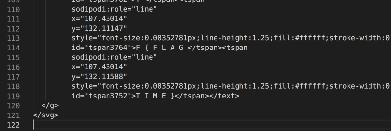

# enhance!

### Description

Download the image file and find the flag.

### Resources

drawing.flag.svg - Picture of a white circle within a black circle

### Solution

Step 1 > Push image through strings into its own txt file

Step 2 > Scroll to bottom

Step 3 > Notice <text></text> section and the flag in amongst each tspan 