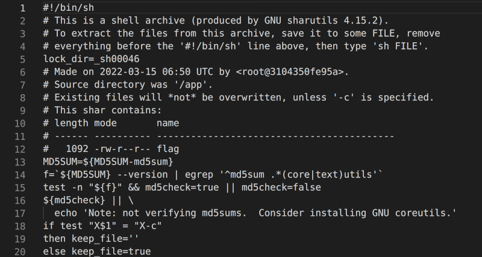
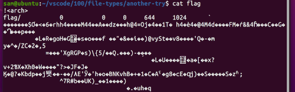

# file-types

### Description

This file was found among some files marked confidential but my pdf reader cannot read it, maybe yours can.

### Resources

Flag.pdf

### Solution

:exclamation: DANGER STRUGGLES AHEAD :exclamation:

Step 1: Push file through strings to see what I can find

```console
sam@ubuntu:~$ strings Flag.pdf > flag-pdf-strings.txt
```

What looks like a shell script...



Step 2: Right click on file and rename fo Flag.sh

Step 3: Change the permissions of the file to allow it to run

```console
sam@ubuntu:~$ chmod +x Flag.sh 
```

Step 4: Run the file

```console
sam@ubuntu:~$ ./Flag.sh
x - created lock directory _sh00046.
x - extracting flag (text)
./Flag.sh: 119: uudecode: not found
restore of flag failed
flag: MD5 check failed
x - removed lock directory _sh00046.
```
But this didn't run the .sh file correctly... so...

Step 5: Search > what is uudecode?

- uudecode is associated with the sharutils package

Step 6: Download and install sharutils

```console
sam@ubuntu:~$ sudo apt install sharutils
```

Step  7: Rerun the file

```console
sam@ubuntu:~$ ./Flag.sh
x - created lock directory _sh00046.
x - extracting flag (text)
x - removed lock directory _sh00046.
```
Success!!

---

Step 8: cat the flag file that is created



Illegable text BUT notice !`<arch>` at the top of the file

Step 9: Search > what is !`<arch>`?

- ar (Unix) > https://en.wikipedia.org/wiki/Ar_(Unix)
- https://linux.die.net/man/1/ar

Step 10: Extract the file from the archive

```console
sam@ubuntu:~$ ar x flag
```

Get another archive...

Step 11:

> From this point onwards I repeated the following steps over and over to get to the final output 

1. Found the file type (For most instances I used [checkfiletype](https://www.checkfiletype.com/))
2. If I don't have the tool I download it
3. Extract the file
4. Rename if necessary
5. And keep going!

> To summarise I am going to include a table of the file-types

<details>
    <summary>Spoiler warning</summary>
    <table>
        <tr>
            <th>file-types</th>
        </tr>
        <tr>
            <td>cpio</td>
        </tr>
        <tr>
            <td>bzip2</td>
        </tr>
        <tr>
            <td>gzip</td>
        </tr>
        <tr>
            <td>lzip</td>
        </tr>
        <tr>
            <td>lz4</td>
        </tr>
        <tr>
            <td>lzma</td>
        </tr>
        <tr>
            <td>lzop</td>
        </tr>
        <tr>
            <td>lzip</td>
        </tr>
    </table>
    In my notes I mention p7zip but also say that it 'DIDN'T WORK' so, if you're not there give it a go.
</details>

Step 12:

```console
sam@ubuntu:~$ cat current
706963Gf4354467b464c414754494d457d
```

Step 33: Put text in [rapidtables](https://www.rapidtables.com/convert/number/hex-to-ascii.html)

FLAGTIME :balloon: :balloon: :balloon:
