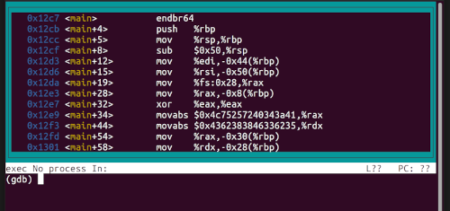

# gdb-test-drive

### Description

Can you get the flag? Here's the test drive instructions:

```console
$ chmod +x gdbme
$ gdb gdbme
(gdb) layout asm
(gdb) break *(main+99)
(gdb) run
(gdb) jump *(main+104)
```

### Resources

gdbme (program)

### Solution

Step 1: Give the program the correct file permissions

```console
sam@ubuntu:~$ chmod +x gdbme
```

Step 2: Run the file using gdb 

```console
sam@ubuntu:~$ gdb gdbme
GNU gdb (Ubuntu 9.2-0ubuntu1~20.04.1) 9.2
Copyright (C) 2020 Free Software Foundation, Inc.
License GPLv3+: GNU GPL version 3 or later <http://gnu.org/licenses/gpl.html>
This is free software: you are free to change and redistribute it.
There is NO WARRANTY, to the extent permitted by law.
Type "show copying" and "show warranty" for details.
This GDB was configured as "x86_64-linux-gnu".
Type "show configuration" for configuration details.
For bug reporting instructions, please see:
<http://www.gnu.org/software/gdb/bugs/>.
Find the GDB manual and other documentation resources online at:
    <http://www.gnu.org/software/gdb/documentation/>.

For help, type "help".
Type "apropos word" to search for commands related to "word"...
Reading symbols from gdbme...
(No debugging symbols found in gdbme)
(gdb)
```

Step 3: Enter 'layout asm'

```console
sam@ubuntu:~$ gdb gdbme
...
(No debugging symbols found in gdbme)
(gdb) layout asm
```



Step 4: Enter 'break *(main+99)'


Step 5: Enter 'run'


Step 6: Enter 'jump *(main+104)'


Flagtime :sparkles: