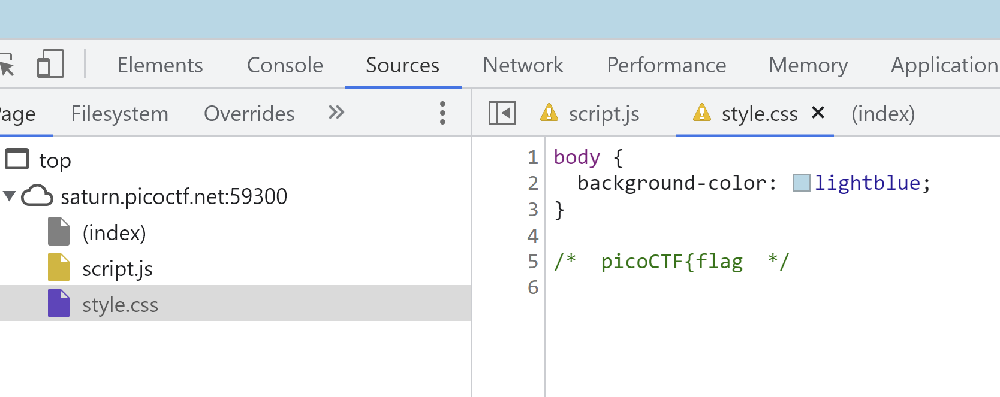
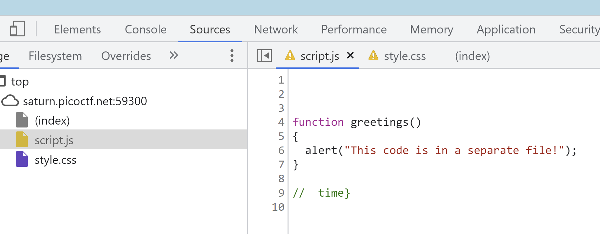

# includes

### Description

Can you get the flag? Go to this website and see what you can discover.

### Resource

Website url

### Solution

Step 1: Open website in chrome browser

Step 2: Open up dev tools

Step 3: Look through the sources tab to find the style.css file

Step 4: Look through the sources tab to find the script.js file

And you should have another flagtime.
